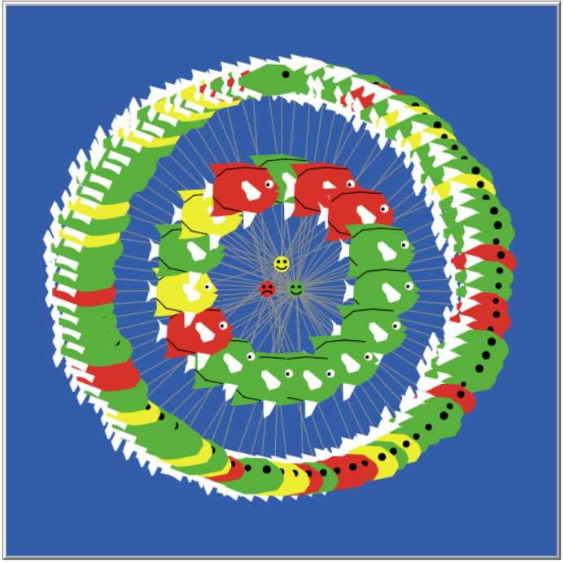
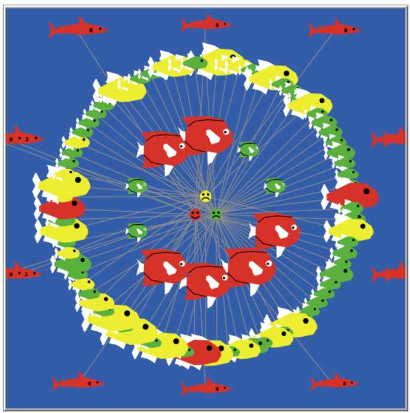

\fontfamily{cmr}
\fontsize{12}{22}
\fontseries{m}
\selectfont

```{r setup, include=FALSE,echo=FALSE}
knitr::opts_chunk$set(echo = TRUE)
source('get-data.r')
endrun.data<-get.tau(file.name="take2 experiment-table-new.csv")
n.repetitions<-get.n.repetitions(endrun.data)
netlogo.data<-read.nlogo.experiment(file.name='take2 experiment-table-new.csv')
```

# Introduction
The Santa Fe Institute Spring 2018 Challenge[@Challenge:2018] models the behaviour of investors choosing between three pools, one providing a stable income, and two others offering riskier returns. The Challenge is a simple model of Technical Analysis[@romero2014hedge, pp. 32]: each investor has access to historical data --- their own choices and payoffs, and aggregate data for each pool --- but no information about "fundamentals"[@romero2014hedge, pp. 32]. 

# Background

Brian Arthur [@arthur1994inductive] investigated the behaviour of people deciding whether to visit the El Farol Bar in Santa Fe, using historical attendance data. Arthur assumed that the visit would be enjoyable if 60 or fewer people attended. There is no rational solution: if an algorithm existed to predict attendance accurately, either everyone would attend, or nobody would, falsifying the prediction.[^1] 
Arthur equipped each person with a bag of fixed strategies for estimating attendance; poorly performing strategies were replaced by ones that have proven more accurate on recent data. Subsequently David Fogel applied evolutionaty computing to the problem [@fogel1999inductive]; linear autoregressive strategies were bred, mutated, and the weakest culled, so that new strategies could be inferred.

[^1]: "Nobody goes there anymore. It's too crowded".--Yogi Berra.

The  Challenge is related to minority games [@challet1997emergence], where players choose to belong to one of two teams, and those who find themselves in the smaller are rewarded: the payouts from our High and Low pools are worthwhile only if the number of "subscribers" is low.

# Methods


I developed a Netlogo[@Wilensky:1999] model,  _challenge.nlogo_, which uses the approach of Fogel [@fogel1999inductive]---an evolutionary algorithm that breeds autoregressive models. It represents Investors and Pools as separate Breeds of Agents. Investors are connected to Pools by Links as shown in Figure \ref{fig:ui}. There are three types of Investors:

 1. The outer circle of fish in  Figure \ref{fig:ui} represent autoregressive agents ("linear predictors"), who use the  number and payoff historical data for both pools;
 1. the inner circle are conservative fish, who select a pool that has worked well in the past (using their memory of their own past decisions and payoffs);
 1. the sharks in Figure \ref{fig:ui-cartel}  unlawfully form a cartel--Section \ref{heading:meta-agents}. They share information and try to manipulate the numbers in one pool to maximise their profit.
 
 Investors do not know the odds of the high and low risk pools paying out, or the amounts to be divided: they need to estimate these values from history. They do, however, understand that the payout needs to be divided between subscribers.

I used a trick described by Abelson et al[@Abelson:1985:SIC:26777] to represent agents' strategies as _closures_. "... a closure is a record storing a function together with an environment. ... A closure...allows the function to access those captured variables through the closure's copies of their values or references, even when the function is invoked outside their scope."[@wiki:closure] In short, closures encapsulates data, very much like classes.

_Challenge.nlogo_ was executed by the _BehaviourSpace_ tool of Netlogo, which performed `r n.repetitions` repetitions. The model can also dump data for each step, e.g. for Figure \ref{fig:plot_individual01}. I used `r R.Version()$version.string` [@rcore2018r] to analyze the data, and an RMarkdown[@allaire2018rmarkdown] script to present the results, as suggested by Rosanna van Hespen[@vanhespen2016thesis]. 

#Results

##General Behaviour:  variation of wealth of the agents over time


Figures \ref{fig:plot_wealth0} and \ref{fig:plot_wealth1} illustrate the growth of aggregate wealth for auto-regressive agents only, over a range of values for $\tau$, and for the number of coefficients in predictors, and the number of predictors in the pool: aggregate wealth tends to increase. Figures \ref{fig:plot_outgoings0} and \ref{fig:plot_outgoings1} show the return per investor in each pool:  they tend to stabilize with returns that are _roughly_ comparable, and better than break even for subscribers. Figures \ref{fig:plot_sq0} and \ref{fig:plot_sq1} show the squared error of the best predictor in each pool. Each figure is plotted using data from `r n.repetitions` separate runs of the model. The error does reduce with time, but remains significant in many runs.


##Diversity: effect of diversity of strategies on dynamics


Figures \ref{fig:plot_individual01} and \ref{fig:plot_individual25} show the growth of wealth for a few of the richest individuals (measured at the end of the run), a few of the poorest, and a few in the middle.  The rich are generally agents who showed promise early, and kept ahead. Since it seems reasonable to expect a good strategy to do better than random assignment, Figure \ref{fig:plot_individual_random} show the results of random decisions for comparison. Rich individuals tend to be lucky several times, rather than grawing steadily.

##Agent Behaviour

Figures \ref{fig:plot_individual01} and \ref{fig:plot_individual25} suggest that there is relatively little variation between the two main classes of agent, Linear Predictors and Conservatives. In contrast, variation within a class of agents is much greater. This is in accord with the weak form of the Efficient Market Hypothesis [@romero2014hedge, ch. 8]: "future asset prices \emph{cannot} be predicted using historical price and volume data".

##Violate Assumptions: allow agents to spy on others\label{heading:violate-sssumptions}

I decided to investigate _envy_: specifically to allow agents to look at the wealth of others and copy the choice made by one other agent that has more than a certain multiplier of its own wealth. In Figures \ref{fig:plot_individual_envy01} and \ref{fig:plot_individual_envy23}, we look at the behaviour if an agent copies the choices of agents with 1.5, 2.0 or 3 times its own wealth. My first impression is that the behaviour is much less orderly. For a low _envy factor_ the linear predictrs are most affected, but for higher values the Conservatives are more affected. NB. A higher the envy factor, means that relatively few high flyers are used as models, so there is more consistency in the intelligence that they provide. 

##Meta-Agents\label{heading:meta-agents}

I implemented a _cartel_, where some agents agree to monopolize one pool for their own benefit---see Figure \ref{fig:ui-cartel}. The cartel artificially increases the number of agents in one pool, to lead other agents to infer that the pool was crowded, and hence unattractive. It does not make sense for the cartel to jump from one pool to another, since they rould have to pay $\tau$, and wait for the second pool to clear out. While a very small cartel has little chance of influencing other agents, a large cartel reduces the payout per member; a cartel of 20 would do no better than someone who stayed in the stable pool. 

Figure \ref{fig:cartel_return} shows the return from the cartel. It scarcely seems worth the risk of ending up in Sante Fe jail for attempting to rig the market.

##Changes-- Variation of $\tau$ and of total number of agents

Figure \ref{fig:tau_wealth} shows the effect of varying $\tau$. Average wealth increases with $\tau$, since wealth is taken aay from investors. Figure \ref{fig:tau_error} shows that the transients in the total error are damped when $\tau>0$, but persist for $\tau=0$. Presumably $\tau$ discourages agents from jumping from pool to pool.

Figure \ref{fig:many_investors} shows the effect of varying the number of agents. The number of subscribers in each pool increasses with number of investors, beyond what is profitable. This effect may be caused by Conservatives being unduly influenced by the return from a pool "in the good old days".

#Discussion and Further Work

I wondered whether 100 steps were enough for the system to settle down, and for the intial conditions to be forgotten, so I needed an _operational definition_: the system can be considered ergodic, and the starting transients to be forgotten, if the moving average of $n$ values is within one standard deviation of the mean, calculated  over the entire trajectory. Figure \ref{fig:plot_ergodic} shows the results of taking $n=11$ and running the simulation for 250 steps, for different values of $\tau$, and varying initial allocations to the low and high risk pools. The transient has disappeared for most runs for $\tau=0$, but most runs are chaotic for $\tau>0$. I believe that 100 steps are adequate if the trajectory is not chaotic; if it is chaotic, increasing the number of steps is unlikely to help. 

Figures \ref{fig:plot_individual01} and \ref{fig:plot_individual25} show that some Investors are better at acquiring wealth than others, as the plots diverge as time goes on; however, they don't indicate whether they are merely better at competing with their companions _in the same simulation_. It would be interesting to construct my own version of the Tournament, sample some of the best agents, and see whether some genius strategies that have emerged; maybe one agent is better than another only in the sense that Scissors is stronger than Paper[@wiki:roshambo]. 

The agents have no knowledge of their own mortality. I considered whether I could develop a theory of stopping [@hill2009knowing], but decided that the Challenge would needed to be embedded in a larger problem first. For instance, an agent might plan to retire at age $x$, but other things might force an earlier retirement, which would mean that his savings might need to last longer. Given some assumptions about the distribution of retirement ages and life expectancy, what is the best strategy? 


```{r echo=FALSE,fig.cap="Investors are linked to Pools: a happy face represents a pool that has paid out, colours represent risk in a natural way (traffic lights), and the size of each fish correlates to the wealth of an investor.\\label{fig:ui}",warning=FALSE, out.width='.9\\linewidth', fig.width=8, fig.height=8,fig.show='hold',fig.align='center',fig.pos = 'p'}

```


```{r echo=FALSE,fig.cap="\\label{fig:plot_wealth0}Variation of Aggregate Wealth with number of coefficients and number of predictors, for $\\tau=0$. Colour is used to distinguish one run for another, and has no other significance.",warning=FALSE, out.width='.49\\linewidth', fig.width=4, fig.height=4,fig.show='hold',fig.align='center',fig.pos = 'p'}
plot.wealth(netlogo.data,tau=0)
plot.wealth(netlogo.data,tau=0,n_coefficients = 6,n_predictors  = 6)
plot.wealth(netlogo.data,tau=0,n_coefficients = 9,n_predictors  = 9)
```

```{r echo=FALSE,fig.cap="\\label{fig:plot_wealth1}Variation of Aggregate Wealth with number of coefficients with number of predictors, for $\\tau=1$. Colour is used to distinguish one run for another, and has no other significance.",warning=FALSE, out.width='.49\\linewidth', fig.width=4, fig.height=4,fig.show='hold',fig.align='center',fig.pos = 'p'}
plot.wealth(netlogo.data,tau=1)
plot.wealth(netlogo.data,tau=1,n_coefficients = 6,n_predictors  = 6)
plot.wealth(netlogo.data,tau=1,n_coefficients = 9,n_predictors  = 9)
```

```{r echo=FALSE,fig.cap="\\label{fig:plot_outgoings0}Variation of Payout per subscriber for $\\tau=0$. NB: payout gradually stabilizes and tends to be confined to a narrow region that is better than break-even for subscribers.",warning=FALSE, out.width='.49\\linewidth', fig.width=4, fig.height=4,fig.show='hold',fig.align='center',fig.pos = 'p'}
plot.outgoings(netlogo.data,tau=0)
plot.outgoings(netlogo.data,tau=0,n_coefficients = 6,n_predictors  = 6)
plot.outgoings(netlogo.data,tau=0,n_coefficients = 9,n_predictors  = 9)
```

```{r echo=FALSE,fig.cap="\\label{fig:plot_outgoings1}Variation of Payout per subscriber , for $\\tau=1$. NB: payout gradually stabilizes and tends to be confined to a narrow region that is better than break-even for subscribers.",warning=FALSE, out.width='.49\\linewidth', fig.width=4, fig.height=4,fig.show='hold',fig.align='center',fig.pos = 'p'}
plot.outgoings(netlogo.data,tau=1)
plot.outgoings(netlogo.data,tau=1,n_coefficients = 6,n_predictors  = 6)
plot.outgoings(netlogo.data,tau=1,n_coefficients = 9,n_predictors  = 9)
```

```{r echo=FALSE,fig.cap="\\label{fig:plot_sq0}Variation of Error for $\\tau=0$. Colour is used to distinguish one run for another, and has no other significance.",warning=FALSE, out.width='.49\\linewidth', fig.width=4, fig.height=4,fig.show='hold',fig.align='center',fig.pos = 'p'}
plot.errors(netlogo.data,tau=0)
plot.errors(netlogo.data,tau=0,n_coefficients = 6,n_predictors  = 6)
plot.errors(netlogo.data,tau=0,n_coefficients = 9,n_predictors  = 9)
```

```{r echo=FALSE,fig.cap="\\label{fig:plot_sq1}Variation of Error for $\\tau=1$. Colour is used to distinguish one run for another, and has no other significance.",warning=FALSE, out.width='.49\\linewidth', fig.width=4, fig.height=4,fig.show='hold',fig.align='center',fig.pos = 'p'}
plot.errors(netlogo.data,tau=1)
plot.errors(netlogo.data,tau=1,n_coefficients = 6,n_predictors  = 6)
plot.errors(netlogo.data,tau=1,n_coefficients = 9,n_predictors  = 9)
```

```{r echo=FALSE,fig.cap="\\label{fig:plot_individual01}Growth of wealth for $\\tau \\in \\{0,1\\}$. Results are shown for a few of the richest individuals (judged at the end of the simulation), a few of the poorest, and a few in the middle. The figures on the left use linear predictors, those on the right are conservative.",warning=FALSE, out.width='.49\\linewidth', fig.width=4, fig.height=4,fig.show='hold',fig.align='center',fig.pos = 'p'}
my.individual.details<-read.csv('./Experiments/details-tau0.csv')
plot.individuals(my.individual.details,my.strategy=1,n=5)
plot.individuals(my.individual.details,my.strategy=0,n=5)
my.individual.details<-read.csv('./Experiments/details-tau1.csv')
plot.individuals(my.individual.details,my.strategy=1,n=5)
plot.individuals(my.individual.details,my.strategy=0,n=5)
```


```{r echo=FALSE,fig.cap="\\label{fig:plot_individual25}Growth of wealth for $\\tau \\in \\{2,5\\}$. The figures on the left use linear predictors, those on the right are conservative.",warning=FALSE, out.width='.49\\linewidth', fig.width=4, fig.height=4,fig.show='hold',fig.align='center',fig.pos = 'p'}
my.individual.details<-read.csv('./Experiments/details-tau2.csv')
plot.individuals(my.individual.details,my.strategy=1,n=5)
plot.individuals(my.individual.details,my.strategy=0,n=5)
my.individual.details<-read.csv('./Experiments/details-tau5.csv')
plot.individuals(my.individual.details,my.strategy=1,n=5)
plot.individuals(my.individual.details,my.strategy=0,n=5)
```

```{r echo=FALSE,fig.cap="\\label{fig:plot_individual_random}Growth of wealth for random assignments. Notice that some of the richest investors start lucky, and continue to be rich despite mediocre performance (the Trump effect).",warning=FALSE, out.width='.49\\linewidth', fig.width=4, fig.height=4,fig.show='hold',fig.align='center',fig.pos = 'p'}
my.individual.details<-read.csv('./Experiments/random-tau0.csv')
plot.individuals(my.individual.details,my.strategy=1,n=5)
my.individual.details<-read.csv('./Experiments/random-tau1.csv')
plot.individuals(my.individual.details,my.strategy=1,n=5)
```


```{r echo=FALSE,fig.cap="Sharks represent members of the Cartel. It appears that cartel members are able to intimidate agents who use the first learning algorithm, but not the second.\\label{fig:ui-cartel}",warning=FALSE, out.width='.49\\linewidth', fig.width=4, fig.height=4,fig.show='hold',fig.align='center',fig.pos = 'p'}

```


```{r plot_cartel, echo=FALSE,fig.cap="\\label{fig:cartel_return}Return from Cartel, compared with Stable Pool",warning=FALSE, out.width='.49\\linewidth', fig.width=4, fig.height=4,fig.show='hold',fig.align='center',fig.pos = 'p'}
cartel.data<-read.cartel()
plot.cartel(cartel.data )
```


```{r plot_wealth, echo=FALSE,fig.cap="\\label{fig:tau_wealth}Variation of accumulated wealth with $\\tau$",warning=FALSE, out.width='.49\\linewidth', fig.width=4, fig.height=4,fig.show='hold',fig.align='center',fig.pos = 'p'}
endrun.data<-get.tau(file.name='take2 experiment-table-new.csv')

tau.agg11 <- extract.wealth.vs.tau(endrun.data,can_borrow=TRUE,randomize_step=TRUE)
plot(tau.agg11$tau,tau.agg11$mean__wealth__of_investors,type="l",col="blue",lty=1,
     xlab="tau",ylab="",yaxt='n',main = "Mean Wealth")
par(new=TRUE)
tau.agg12 <- extract.wealth.vs.tau(endrun.data,can_borrow=TRUE,randomize_step=FALSE)
plot(tau.agg12$tau,tau.agg12$mean__wealth__of_investors,type="l",col="magenta",lty=2,
     xlab="",ylab="",yaxt='n')
par(new=TRUE)
tau.agg21 <- extract.wealth.vs.tau(endrun.data,can_borrow=FALSE,randomize_step=TRUE)
plot(tau.agg21$tau,tau.agg21$mean__wealth__of_investors,type="l",col="slategray",lty=6,
     xlab="",ylab="",yaxt='n')
par(new=TRUE)
tau.agg22 <- extract.wealth.vs.tau(endrun.data,can_borrow=FALSE,randomize_step=FALSE)
plot(tau.agg22$tau,tau.agg22$mean__wealth__of_investors,type="l",col="steelblue",lty=4,
     xlab="",ylab="",yaxt='n')
legend("bottomright", legend=c("TT", "FT","TF","FF"),
       col=c("blue", "magenta","slategrey","steelblue"), lty=c(1,2,6,4), cex=0.8)

plot(tau.agg11$tau,tau.agg11$standard_deviation__wealth__of_investors,type="l",col="blue",lty=1,
     xlab="tau",ylab="",yaxt='n',main="Standard Deviation")
par(new=TRUE)
plot(tau.agg12$tau,tau.agg12$standard_deviation__wealth__of_investors,type="l",col="magenta",lty=2,
     xlab="",ylab="",yaxt='n')
par(new=TRUE)
plot(tau.agg21$tau,tau.agg21$standard_deviation__wealth__of_investors,type="l",col="slategray",lty=6,
     xlab="",ylab="",yaxt='n')
par(new=TRUE)
plot(tau.agg22$tau,tau.agg22$standard_deviation__wealth__of_investors,type="l",col="black",lty=5,
     xlab="",ylab="",yaxt='n')
```


```{r plot_errors, echo=FALSE,fig.cap="\\label{fig:tau_error}Variation of Error with $\\tau$",warning=FALSE, out.width='.49\\linewidth', fig.width=4, fig.height=4,fig.show='hold',fig.align='center',fig.pos = 'p'}
dd<-read.nlogo.experiment(file.name='take2 experiment-table-new.csv')
zz0<-extract.errors.vs.tau(dd)
aa0<-aggregate(zz0,by=list(zz0$X_step_),FUN=mean,na.rm=TRUE)
zz1<-extract.errors.vs.tau(dd,tau=1)
aa1<-aggregate(zz1,by=list(zz1$X_step_),FUN=mean,na.rm=TRUE)
zz5<-extract.errors.vs.tau(dd,tau=5)
aa5<-aggregate(zz5,by=list(zz5$X_step_),FUN=mean,na.rm=TRUE)


plot(aa0$X_step_,aa0$mean__sum_squares_error__of_investors,type="l",col="blue",lty=1,xlab="Step",ylab="",yaxt='n',main="Variation of Squared error")
legend("topright", legend=c("tau=0", "tau=1","tau=5"),
       col=c("blue", "magenta","slategrey"), lty=c(1,2,6), cex=0.8)
par(new=TRUE)
plot(aa1$X_step_,aa1$mean__sum_squares_error__of_investors,type="l",col="magenta",lty=2,xlab="",ylab="",yaxt='n')
par(new=TRUE)
plot(aa5$X_step_,aa5$mean__sum_squares_error__of_investors,type="l",col="slategray",lty=6,xlab="",ylab="",yaxt='n')
```


```{r plot_many_investors, echo=FALSE,fig.cap="\\label{fig:many_investors}Many Investors, showing number in each pool. The reference line shows the maximum number of subscribers if pool is to be profitable.",warning=FALSE, out.width='.49\\linewidth', fig.width=4, fig.height=4,fig.show='hold',fig.align='center',fig.pos = 'p'}
many.investors.data<-fix.column.names(read.nlogo.experiment(file.name="challenge-many-investors-table.csv"))
many.investors.last.step.data<-get.last.step.data( many.investors.data)
many.investors.means<-aggregate(many.investors.last.step.data,by=list(many.investors.last.step.data$tau,many.investors.last.step.data$n_investors,many.investors.last.step.data$p_experiencers),FUN=mean,na.rm=TRUE)
plot.many.investors.pools(many.investors.means)
plot.many.investors.pools(many.investors.means,tau=1)
plot.many.investors.pools(many.investors.means,p_experiencers=0)
plot.many.investors.pools(many.investors.means,tau=1,p_experiencers=0)

```

```{r echo=FALSE,fig.cap="\\label{fig:plot_individual_envy01}The effects of allowing agents to spy on each other--see Section \\ref{heading:violate-sssumptions}. The top two plots form a control. The lower two show the effect of envy: if an agent is not in the upper stratum, as defined by the envy factor, it copies the behaviour of a randomly selected top player. See also remarks on Figure \\ref{fig:plot_individual01}",warning=FALSE, out.width='.49\\linewidth', fig.width=4, fig.height=4,fig.show='hold',fig.align='center',fig.pos = 'p'}
my.individual.details<-read.csv('./Experiments/envy1.csv')
plot.individuals(my.individual.details,my.strategy=1,n=5)
plot.individuals(my.individual.details,my.strategy=0,n=5)
my.individual.details<-read.csv('./Experiments/envy1_5.csv')
plot.individuals(my.individual.details,my.strategy=1,n=5,sub=sprintf("Envy factor 1.5"))
plot.individuals(my.individual.details,my.strategy=0,n=5,sub=sprintf("Envy factor 1.5"))
```

```{r echo=FALSE,fig.cap="\\label{fig:plot_individual_envy23}The effects of allowing agents to spy on each other (continued).",warning=FALSE, out.width='.49\\linewidth', fig.width=4, fig.height=4,fig.show='hold',fig.align='center',fig.pos = 'p'}
my.individual.details<-read.csv('./Experiments/envy2.csv')
plot.individuals(my.individual.details,my.strategy=1,n=5,sub=sprintf("Envy factor 2.0"))
plot.individuals(my.individual.details,my.strategy=0,n=5,sub=sprintf("Envy factor 2.0"))
my.individual.details<-read.csv('./Experiments/envy3.csv')
plot.individuals(my.individual.details,my.strategy=1,n=5,sub=sprintf("Envy factor 3.0"))
plot.individuals(my.individual.details,my.strategy=0,n=5,sub=sprintf("Envy factor 3,0"))
```

```{r echo=FALSE,fig.cap="\\label{fig:plot_ergodic}Transient Behaviour. Plots show the number of steps required before the moving average over a few steps is close to the average over the entire run. We treat this as an estimate of the number of steps required for decay of the transient from starting conditions. NB: a value of 250 means that the trajectory has not stabilized, and is possibley chaotic: it does not mean that the trajectory has stabilized magically after 250 steps. ",warning=FALSE,out.width='.49\\linewidth', fig.width=4, fig.height=4,fig.show='hold',fig.align='center',fig.pos = 'p'}
n=11
nsigma=1.0
ergodic.data<-read.nlogo.experiment(file.name = "challenge-transients-table.csv")
ergodic.metrics<-analyze.ergodicity(ergodic.data,n=n,nsigma = nsigma,tau=0)
onset<-as.numeric(ergodic.metrics$onset)
hist(onset,
     main = sprintf("tau=%d, n=%d, nsigma=%.1f",0,n,nsigma),
     xlab="Onset of ergodicity",
     col="blue",
     las=1,
     prob=TRUE)
lines(density(onset))

ergodic.metrics<-analyze.ergodicity(ergodic.data,n=n,nsigma = nsigma,tau=1)
onset<-as.numeric(ergodic.metrics$onset)
hist(onset,
     main = sprintf("tau=%d, n=%d, nsigma=%.1f",1,n,nsigma),
     xlab="Onset of ergodicity",
     col="blue",
     las=1,
     prob=TRUE)
lines(density(onset))

ergodic.metrics<-analyze.ergodicity(ergodic.data,n=n,nsigma = nsigma,tau=2)
onset<-as.numeric(ergodic.metrics$onset)
hist(onset,
     main = sprintf("tau=%d, n=%d, nsigma=%.1f",2,n,nsigma),
     xlab="Onset of ergodicity",
     col="blue",
     las=1,
     prob=TRUE)
lines(density(onset))


ergodic.metrics<-analyze.ergodicity(ergodic.data,n=n,nsigma = nsigma,tau=5)
onset<-as.numeric(ergodic.metrics$onset)
hist(onset,
     main = sprintf("tau=%d, n=%d, nsigma=%.1f",5,n,nsigma),
     xlab="Onset of ergodicity",
     col="blue",
     las=1,
     prob=TRUE)
lines(density(onset))

```


#References
 
 


