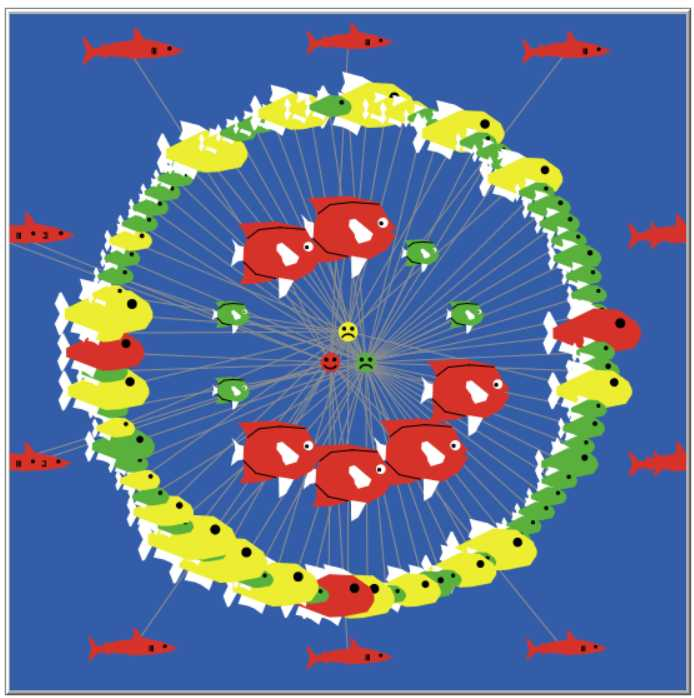

\fontfamily{cmr}
\fontsize{12}{22}
\fontseries{m}
\selectfont

```{r setup, include=FALSE,echo=FALSE}
knitr::opts_chunk$set(echo = TRUE)
source('get-data.r')
endrun.data<-get.tau(file.name="take2 experiment-table-new.csv")
n.repetitions<-get.n.repetitions(endrun.data)
netlogo.data<-read.nlogo.experiment(file.name='take2 experiment-table-new.csv')
```

# Introduction
The Santa Fe Institute Spring 2018 Challenge[@Challenge:2018] models the behaviour of investors choosing between three pools, one providing a stable income stream, and two others offering riskier, but potentially higher, returns. The Challenge can be interpreted as a simple model of Technical Analysis[@romero2014hedge, pp. 32]: each investor has access to historical data --- their own choices and payoffs, and aggregate data for each pool --- but no information about fundamentals --- such as the fact the High Risk Pool is likely to pay out next step because the fund manager invested in a commodity that has become scarce. As expected the simulation supports the weak form of the Efficient Market Hypothesis [@romero2014hedge, ch. 8]: "future asset prices \emph{cannot} be predicted using historical price and volume data".

# Background

Brian Arthur [@arthur1994inductive] investigated the behaviour of people deciding whether to visit the El Farol Bar in Santa Fe, guided only be historical attendance data. Arthur assumed that the visit would be enjoyable if 60 or fewer people attended. He noted that there is no rational solution: if an algorithm existed to predict attendance accurately, either everyone would attend, or nobody would, falsifying the prediction.[^1] 
Instead he modelled Bounded Rationality by equipping each person with a bag of fixed strategies for estimating attendance; poorly performing strategies are replaced by ones that have proven more accurate on recent data. Subsequently David Fogel applied evolutionaty computing to the problem
[@fogel1999inductive]; linear autoregressive strategies were bred, mutated, and the weakest culled, so that new strategies could be inferred.

[^1]: "Nobody goes there anymore. It's too crowded".--Yogi Berra.

The El Farol problem can be generalized to the Minority game [@challet1997emergence], where players choose to belong to one of two sets; those who find themselves in the smaller set are rewarded. The  Challenge is clearly related to minority games, since the rewards from the High and Low pools are worthwhile only if the number of "subscribers" is low enough.

# Methods


I developed two Netlogo[@Wilensky:1999] models, _sheep-wall-stret.nlogo_ and _challenge.nlogo_.

 * The first followed the approach of [@arthur1994inductive], using a "bag of strategies" to assign agents to pools. The strategies include _stay in pool_, _jump at random_, and _estimate length_--- to select pool offering the best likely return. Each agent kept track of the performance of the strategies in its bag, and replaced them if they are not doing well. The limitation of this  approach is that new strategies cannot arise.
  * _Challenge.nlogo_ uses the approach of Fogel [@fogel1999inductive]---a genetic algorithm that breeds autoregressive models. It represents Investors and Pools as separate Breeds of Agents. Investors are connected to Pools by Links as shown in Figure \ref{fig:ui}. There are three types of agents:
    1. The outer circle of fish in  Figure \ref{fig:ui} represent autoregressive agents, who use the  number and payoff historical data for both pools;
    1. the inner circle are conservative fish, who select a pool that has worked well in the past (using their memory of their own past decisions and payoffs)[@hill2009knowing];
    1. the sharks in Figure \ref{fig:ui-cartel}  unlawfully form a cartel. They share information and try to manipulate the numbers in one pool to maximise their profit. They are discussed in Section \ref{heading:violate-sssumptions}.

I used a trick described in [@Abelson:1985:SIC:26777] to represent predictors as closures.
c
_Challenge.nlogo_ was executed by the BehaviourSpace tool of Netlogo, which performed `r n.repetitions` repetitions. The model can also dump data for each step, e.g. for Figure \ref{fig:plot_individual01}. I used `r R.Version()$version.string` [@rcore2018r] to analyze the data, and an RMarkdown[@allaire2018rmarkdown] script to present the results, as suggested by Rosanna van Hespen[@vanhespen2016thesis]. 

#Results

##General Behaviour

_What general behaviors arise in this system?  How does the wealth of the agents change over time? At the aggregate level? At the individual level?_

What effect do the initial conditions have on the results. According to [@sep-ergodic-hierarchy], a system is _ergodic_ iff $f* =\bar f$, where $f*$ is the infinite time average and $\bar f$ the space average for all complex-valued Lebesgue integrable functions $f$ almost everywhere, meaning for almost all initial conditions. See Figure \ref{fig:plot_ergodic}

Figures \ref{fig:plot_wealth0} and \ref{fig:plot_wealth1} illustrate the growth of wealth, over a range of values for $\tau$, and for the number of coefficients in predictors, and the number of predictors in the pool. Figures \ref{fig:plot_outgoings0} and \ref{fig:plot_outgoings1} show the return per investor in each pool: notice that they tend to stablize with returns that are roughly comparable. Figures \ref{fig:plot_sq0} and \ref{fig:plot_sq1} show the squared error of the best predictor in each pool. Each figure is plotted using data from `r n.repetitions` separate runs of the model.

Figures \ref{fig:plot_individual01} and \ref{fig:plot_individual25} show the growth of wealth for a few of the richest individuals, a few of the poorest, and a few in the middle. Since it seems reasonable to expect a strategy to do better than random assignment, assuming it is any good, Figure \ref{fig:plot_individual_random} show the results of random decisions for comparison.


##Diversity

_How does the diversity of strategies influence the dynamics of the system?_

##Agent Behaviour

_Are there generally classes of agent behavior (say, based on what data they use, how they process it, or the agent's overall sophistication) that lead to better performance?_

##Violate Assumptions\label{heading:violate-sssumptions}

_What happens to the system if you violate one of the original assumptions of the problem and allow the agents to alter their strategies over time by observing the performance and strategic details of the other agents?_

##Meta-Agents

I implemented a _cartel_, where some agents agree to monopolize one pool for their own benefit---see Figure \ref{fig:ui-cartel}. The cartel artificially increases the number of agents in one pool, to lead other agents to infer that the pool was crowded, and hence unattractive. It does not make sense for the cartel to jump from one pool to another, since they rould have to pay $\tau$, and wait for the second pool to clear out. While a very small cartel has little chance of influencing other agents, a large cartel reduces the payout per member; a cartel of 20 would do no better than someone who stayed in the stable pool. 

Figure\ref{fig:cartel_return} shows the return from the cartel. It scarcely seems worth the risk of ending up in Sante Fe jail for attmpting to rig the market.

##Changes-- Variation of $\tau$ and of total number of agents

Figure \ref{fig:tau_wealth} shows the effect of varying $\tau$. Paradoxically total wealth increases with $\tau$. Figure \ref{fig:tau_error} shows that the transients in the total error are damped when $\tau>0$, but persist for $\tau=0$. Presumably $\tau$ discourages agents from jumping from pool to pool.

Figure \ref{fig:many_investors} shows the effect of varying the number of agents.

#Discussion


#Acknowledgements

I wish to thank the SFI staff and mentors, and my fellow students for friendly and helpful discussions and recommended reading.

```{r echo=FALSE,fig.cap="Investors are linked to Pools: a happy face represents a pool that has paid out, colours represent risk in a natural way (traffic lights), and the size of each fish correlates to the wealth of an investor.\\label{fig:ui}",warning=FALSE, out.width='.9\\linewidth', fig.width=8, fig.height=8,fig.show='hold',fig.align='center',fig.pos = 'p'}
knitr::include_graphics('view.jpg')

```

```{r echo=FALSE,fig.cap="\\label{fig:plot_ergodic}Transient Behaviour",warning=FALSE, out.width='.49\\linewidth', fig.width=4, fig.height=4,fig.show='hold',fig.align='center',fig.pos = 'p'}
n=7
nsigma=1.0
ergodic.data<-read.nlogo.experiment(file.name = "challenge-transients-table.csv")
ergodic.metrics<-analyze.ergodicity(ergodic.data,n=n,nsigma = nsigma,tau=0)
onset<-as.numeric(ergodic.metrics$onset)
hist(onset,
     main = sprintf("End of transient behaviour, tau=0",n,nsigma),
     xlab="Onset of ergodicity",
     col="blue",
     las=1,
     prob=TRUE)
lines(density(onset))
ergodic.metrics<-analyze.ergodicity(ergodic.data,n=n,nsigma = nsigma,tau=1)
onset<-as.numeric(ergodic.metrics$onset)
hist(onset,
     main = sprintf("End of transient behaviour, tau=1",n,nsigma),
     xlab="Onset of ergodicity",
     col="blue",
     las=1,
     prob=TRUE)
lines(density(onset))
ergodic.metrics<-analyze.ergodicity(ergodic.data,n=n,nsigma = nsigma,tau=5)
onset<-as.numeric(ergodic.metrics$onset)
hist(onset,
     main = sprintf("End of transient behaviour, tau=5",n,nsigma),
     xlab="Onset of ergodicity",
     col="blue",
     las=1,
     prob=TRUE)
lines(density(onset))
#legend('topleft')
```


```{r echo=FALSE,fig.cap="\\label{fig:plot_wealth0}Variation of Wealth with number of coefficients and number of predictors, for $\\tau=0$",warning=FALSE, out.width='.49\\linewidth', fig.width=4, fig.height=4,fig.show='hold',fig.align='center',fig.pos = 'p'}
plot.wealth(netlogo.data,tau=0)
plot.wealth(netlogo.data,tau=0,n_coefficients = 6)
plot.wealth(netlogo.data,tau=0,n_predictors  = 6)
plot.wealth(netlogo.data,tau=0,n_coefficients = 6,n_predictors  = 6)
plot.wealth(netlogo.data,tau=0,n_coefficients = 9,n_predictors  = 9)
```

```{r echo=FALSE,fig.cap="\\label{fig:plot_wealth1}Variation of Wealth with number of coefficients with number of predictors, for $\\tau=1$",warning=FALSE, out.width='.49\\linewidth', fig.width=4, fig.height=4,fig.show='hold',fig.align='center',fig.pos = 'p'}
plot.wealth(netlogo.data,tau=1)
plot.wealth(netlogo.data,tau=1,n_coefficients = 6)
plot.wealth(netlogo.data,tau=1,n_predictors  = 6)
plot.wealth(netlogo.data,tau=1,n_coefficients = 6,n_predictors  = 6)
plot.wealth(netlogo.data,tau=1,n_coefficients = 9,n_predictors  = 9)
```

```{r echo=FALSE,fig.cap="\\label{fig:plot_outgoings0}Variation of Payout with number of coefficients and number of predictors, for $\\tau=0$",warning=FALSE, out.width='.49\\linewidth', fig.width=4, fig.height=4,fig.show='hold',fig.align='center',fig.pos = 'p'}
plot.outgoings(netlogo.data,tau=0)
plot.outgoings(netlogo.data,tau=0,n_coefficients = 6)
plot.outgoings(netlogo.data,tau=0,n_predictors  = 6)
plot.outgoings(netlogo.data,tau=0,n_coefficients = 6,n_predictors  = 6)
plot.outgoings(netlogo.data,tau=0,n_coefficients = 9,n_predictors  = 9)
```

```{r echo=FALSE,fig.cap="\\label{fig:plot_outgoings1}Variation of Payout with number of coefficients with number of predictors, for $\\tau=1$",warning=FALSE, out.width='.49\\linewidth', fig.width=4, fig.height=4,fig.show='hold',fig.align='center',fig.pos = 'p'}
plot.outgoings(netlogo.data,tau=1)
plot.outgoings(netlogo.data,tau=1,n_coefficients = 6)
plot.outgoings(netlogo.data,tau=1,n_predictors  = 6)
plot.outgoings(netlogo.data,tau=1,n_coefficients = 6,n_predictors  = 6)
plot.outgoings(netlogo.data,tau=1,n_coefficients = 9,n_predictors  = 9)
```

```{r echo=FALSE,fig.cap="\\label{fig:plot_sq0}Variation of Error with number of coefficients and number of predictors, for $\\tau=0$",warning=FALSE, out.width='.49\\linewidth', fig.width=4, fig.height=4,fig.show='hold',fig.align='center',fig.pos = 'p'}
plot.errors(netlogo.data,tau=0)
plot.errors(netlogo.data,tau=0,n_coefficients = 6)
plot.errors(netlogo.data,tau=0,n_predictors  = 6)
plot.errors(netlogo.data,tau=0,n_coefficients = 6,n_predictors  = 6)
plot.errors(netlogo.data,tau=0,n_coefficients = 9,n_predictors  = 9)
```

```{r echo=FALSE,fig.cap="\\label{fig:plot_sq1}Variation of Error with number of coefficients with number of predictors, for $\\tau=1$",warning=FALSE, out.width='.49\\linewidth', fig.width=4, fig.height=4,fig.show='hold',fig.align='center',fig.pos = 'p'}
plot.errors(netlogo.data,tau=1)
plot.errors(netlogo.data,tau=1,n_coefficients = 6)
plot.errors(netlogo.data,tau=1,n_predictors  = 6)
plot.errors(netlogo.data,tau=1,n_coefficients = 6,n_predictors  = 6)
plot.errors(netlogo.data,tau=1,n_coefficients = 9,n_predictors  = 9)
```

```{r echo=FALSE,fig.cap="\\label{fig:plot_individual01}Growth of wealth for $\\tau \\in \\{0,1\\}$. Results are shown for a few of the richest individuals (judged at the end of the simulation), a few of the poorest, and a few in the middle.",warning=FALSE, out.width='.49\\linewidth', fig.width=4, fig.height=4,fig.show='hold',fig.align='center',fig.pos = 'p'}
my.individual.details<-read.csv('C:/Users/Weka/201804/Experiments/details-tau0.csv')
plot.individuals(my.individual.details,my.strategy=1,n=5)
plot.individuals(my.individual.details,my.strategy=0,n=5)
my.individual.details<-read.csv('C:/Users/Weka/201804/Experiments/details-tau1.csv')
plot.individuals(my.individual.details,my.strategy=1,n=5)
plot.individuals(my.individual.details,my.strategy=0,n=5)
```

```{r echo=FALSE,fig.cap="\\label{fig:plot_individual25}Growth of wealth for $\\tau \\in \\{2,5\\}$",warning=FALSE, out.width='.49\\linewidth', fig.width=4, fig.height=4,fig.show='hold',fig.align='center',fig.pos = 'p'}
my.individual.details<-read.csv('C:/Users/Weka/201804/Experiments/details-tau2.csv')
plot.individuals(my.individual.details,my.strategy=1,n=5)
plot.individuals(my.individual.details,my.strategy=0,n=5)
my.individual.details<-read.csv('C:/Users/Weka/201804/Experiments/details-tau5.csv')
plot.individuals(my.individual.details,my.strategy=1,n=5)
plot.individuals(my.individual.details,my.strategy=0,n=5)
```

```{r echo=FALSE,fig.cap="\\label{fig:plot_individual_random}Growth of wealth for random assignments",warning=FALSE, out.width='.49\\linewidth', fig.width=4, fig.height=4,fig.show='hold',fig.align='center',fig.pos = 'p'}
my.individual.details<-read.csv('C:/Users/Weka/201804/Experiments/random-tau0.csv')
plot.individuals(my.individual.details,my.strategy=1,n=5)
my.individual.details<-read.csv('C:/Users/Weka/201804/Experiments/random-tau1.csv')
plot.individuals(my.individual.details,my.strategy=1,n=5)
```


```{r echo=FALSE,fig.cap="Sharks represent members of the Cartel. It appears that cartel members are able to intimidate agents who use the first learning algorithm, but not the second.\\label{fig:ui-cartel}",warning=FALSE, out.width='.49\\linewidth', fig.width=4, fig.height=4,fig.show='hold',fig.align='center',fig.pos = 'p'}

```


```{r plot_wealth, echo=FALSE,fig.cap="\\label{fig:tau_wealth}Variation of accumulated wealth with $\\tau$",warning=FALSE, out.width='.49\\linewidth', fig.width=4, fig.height=4,fig.show='hold',fig.align='center',fig.pos = 'p'}
endrun.data<-get.tau(file.name='take2 experiment-table-new.csv')

tau.agg11 <- extract.wealth.vs.tau(endrun.data,can_borrow=TRUE,randomize_step=TRUE)
plot(tau.agg11$tau,tau.agg11$mean__wealth__of_investors,type="l",col="blue",lty=1,
     xlab="tau",ylab="",yaxt='n',main = "Mean Wealth")
par(new=TRUE)
tau.agg12 <- extract.wealth.vs.tau(endrun.data,can_borrow=TRUE,randomize_step=FALSE)
plot(tau.agg12$tau,tau.agg12$mean__wealth__of_investors,type="l",col="magenta",lty=2,
     xlab="",ylab="",yaxt='n')
par(new=TRUE)
tau.agg21 <- extract.wealth.vs.tau(endrun.data,can_borrow=FALSE,randomize_step=TRUE)
plot(tau.agg21$tau,tau.agg21$mean__wealth__of_investors,type="l",col="slategray",lty=6,
     xlab="",ylab="",yaxt='n')
par(new=TRUE)
tau.agg22 <- extract.wealth.vs.tau(endrun.data,can_borrow=FALSE,randomize_step=FALSE)
plot(tau.agg22$tau,tau.agg22$mean__wealth__of_investors,type="l",col="steelblue",lty=4,
     xlab="",ylab="",yaxt='n')
legend("bottomright", legend=c("TT", "FT","TF","FF"),
       col=c("blue", "magenta","slategrey","steelblue"), lty=c(1,2,6,4), cex=0.8)

plot(tau.agg11$tau,tau.agg11$standard_deviation__wealth__of_investors,type="l",col="blue",lty=1,
     xlab="tau",ylab="",yaxt='n',main="Standard Deviation")
par(new=TRUE)
plot(tau.agg12$tau,tau.agg12$standard_deviation__wealth__of_investors,type="l",col="magenta",lty=2,
     xlab="",ylab="",yaxt='n')
par(new=TRUE)
plot(tau.agg21$tau,tau.agg21$standard_deviation__wealth__of_investors,type="l",col="slategray",lty=6,
     xlab="",ylab="",yaxt='n')
par(new=TRUE)
plot(tau.agg22$tau,tau.agg22$standard_deviation__wealth__of_investors,type="l",col="black",lty=5,
     xlab="",ylab="",yaxt='n')
```


```{r plot_errors, echo=FALSE,fig.cap="\\label{fig:tau_error}Variation of Error with $\\tau$",warning=FALSE, out.width='.49\\linewidth', fig.width=4, fig.height=4,fig.show='hold',fig.align='center',fig.pos = 'p'}
dd<-read.nlogo.experiment(file.name='take2 experiment-table-new.csv')
zz0<-extract.errors.vs.tau(dd)
aa0<-aggregate(zz0,by=list(zz0$X_step_),FUN=mean,na.rm=TRUE)
zz1<-extract.errors.vs.tau(dd,tau=1)
aa1<-aggregate(zz1,by=list(zz1$X_step_),FUN=mean,na.rm=TRUE)
zz5<-extract.errors.vs.tau(dd,tau=5)
aa5<-aggregate(zz5,by=list(zz5$X_step_),FUN=mean,na.rm=TRUE)


plot(aa0$X_step_,aa0$mean__sum_squares_error__of_investors,type="l",col="blue",lty=1,xlab="Step",ylab="",yaxt='n',main="Variation of Squared error")
legend("topright", legend=c("tau=0", "tau=1","tau=5"),
       col=c("blue", "magenta","slategrey"), lty=c(1,2,6), cex=0.8)
par(new=TRUE)
plot(aa1$X_step_,aa1$mean__sum_squares_error__of_investors,type="l",col="magenta",lty=2,xlab="",ylab="",yaxt='n')
par(new=TRUE)
plot(aa5$X_step_,aa5$mean__sum_squares_error__of_investors,type="l",col="slategray",lty=6,xlab="",ylab="",yaxt='n')
```


```{r plot_cartel, echo=FALSE,fig.cap="\\label{fig:cartel_return}Return from Cartel, compared with Stable Pool",warning=FALSE, out.width='.49\\linewidth', fig.width=4, fig.height=4,fig.show='hold',fig.align='center',fig.pos = 'p'}
cartel.data<-read.cartel()
plot.cartel(cartel.data )
```

```{r plot_many_investors, echo=FALSE,fig.cap="\\label{fig:many_investors}Many Investors",warning=FALSE, out.width='.49\\linewidth', fig.width=4, fig.height=4,fig.show='hold',fig.align='center',fig.pos = 'p'}
many.investors.data<-fix.column.names(read.nlogo.experiment(file.name="challenge-many-investors-table.csv"))
many.investors.last.step.data<-get.last.step.data( many.investors.data)
many.investors.means<-aggregate(many.investors.last.step.data,by=list(many.investors.last.step.data$tau,many.investors.last.step.data$n_investors,many.investors.last.step.data$p_experiencers),FUN=mean,na.rm=TRUE)
plot.many.investors.pools(many.investors.means)
plot.many.investors.pools(many.investors.means,tau=1)
plot.many.investors.pools(many.investors.means,tau=5)
plot.many.investors.pools(many.investors.means,p_experiencers=0.5)
plot.many.investors.pools(many.investors.means,tau=1,p_experiencers=0.5)
plot.many.investors.pools(many.investors.means,tau=5,p_experiencers=0.5)

```

#References
 
 


